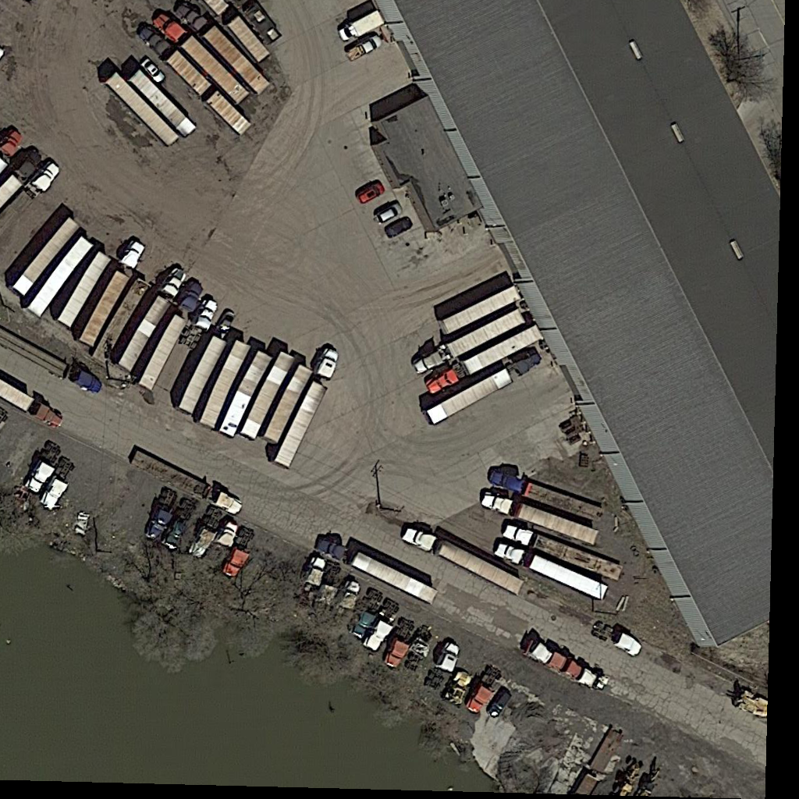

# Oriented Object Detection Using Aeiral Images

## Overview

This repository contains code for training an object detection model on aerial images with oriented bounding boxes (OBB). The model is based on YOLOv8 architecture and is trained for 20 epochs using Google Colab. The dataset comprises 14,000 aerial images annotated with oriented labels. There are five classes in the dataset: vehicle, plane, bridge, harbor, and ship.

## Dataset

The dataset consists of 14,000 aerial images, each annotated with oriented bounding box labels. These labels have been preprocessed to fit the requirements of the YOLOv8-OBB model.

## Model Training

The YOLOv8-OBB model is trained for 20 epochs on Google Colab. During training, the model learns to detect and localize objects of five classes in the aerial images.
